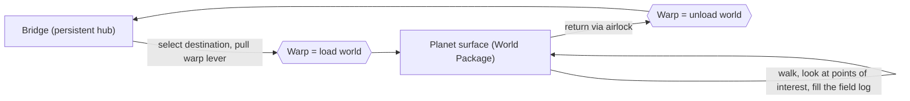

# Wayfinder

> A guided space-travel experience for the Samsung Galaxy XR headset. Command a ship, warp between **real** worlds of the solar system, and walk their surfaces on foot while their real science is revealed to you.

**Status:** design and planning complete, no engine code yet. This repo currently holds the research, the approved design, and a phased build plan. Building starts at [Phase 0 of the plan](docs/plans/2026-07-20-wayfinder-v1.md).

> **Note on the name:** "Wayfinder" is an internal codename only. It is a live trademark held by another game studio, and "Strange New Worlds" is an active Paramount series title. A public product name must be cleared in trademark classes 9 and 41 before any branding. See [IDEATION.md](IDEATION.md#tier-1) for the detail.

---

## What it is

You stand on the bridge of your own ship. You pick a destination on a viewscreen star map and pull the warp lever. The warp jump plays while the next world streams in behind it, then you step through the airlock onto the real surface of Mars or the Moon. You walk a bounded, iconic landing site (the Olympus Mons caldera rim, a stretch of Valles Marineris, the Shackleton crater rim) and look at points of interest to learn what is genuinely there. A field log fills as you discover them. Then you return to the bridge and travel on.

It is **awe first, with light optional goals, and no way to fail or die.** Think of it as the calm, curious feeling of "seeking out new worlds," grounded in real planetary science rather than fiction.

## Why these choices (the one hard reality)

The Galaxy XR is a standalone mobile headset. It **renders** worlds; it does not build them live. Every world is authored offline on a PC and baked into the app as a finished asset the headset just draws. That single fact shapes the whole architecture: worlds are bounded "landing sites" swapped one at a time, and the warp jump exists partly to hide the moment a world loads. The full reasoning, and the survey of the technology behind it, is in [IDEATION.md](IDEATION.md) (open [IDEATION.html](IDEATION.html) in a browser for the readable version).

## Core loop



## Architecture in one paragraph

One **bridge scene stays loaded forever**. Each world is a self-contained **World Package** (its terrain, its points of interest, its real physics values, its sky and light, its ambient audio) that loads on top of the bridge on demand and unloads when you leave. The warp effect covers that load/unload time. Adding a new world is just adding another package; the future AI companion reads the same package data with no rewrite. Full detail, with diagrams: **[docs/ARCHITECTURE.md](docs/ARCHITECTURE.md)**.

## Content pipeline (how a real planet becomes a walkable place)

Mars and the Moon come from free public data. A "digital elevation model" is a height map of real terrain, published by NASA and the US Geological Survey (Mars: MOLA global elevation plus high-detail HiRISE/HRSC where it exists; Moon: LRO/LOLA elevation), with the real orbital photo draped over it as the surface texture. The height map is cropped and converted with GDAL/QGIS, imported as Unity terrain at true metric scale, so the ground you walk is the genuine shape of that place. No Gaussian splats are needed for this pillar; those are for scanned Earth places, which come later.

## Target hardware and the constraints it imposes

Built for the **Samsung Galaxy XR** (Android XR, Snapdragon XR2+ Gen 2). The non-negotiable budgets that shape the design:

| Constraint | Requirement |
|---|---|
| Frame rate | 72 fps minimum, 90 fps target |
| Render resolution | at least 1856 x 2160 per eye |
| Play space | fully playable within a 2.0 m radius (seated or standing) |
| Locomotion | teleport / world-grab / snap-turn only; **no smooth continuous camera rotation** (it fails the store rules and causes nausea) |
| Input | hand tracking is the default; must be playable with no controllers |

## Tech stack

- **Engine:** Unity 6 LTS (Android XR support is generally available), Universal Render Pipeline on Vulkan.
- **XR:** OpenXR + the Unity OpenXR: Android XR provider, XR Interaction Toolkit, XR Hands, AR Foundation.
- **Data tooling:** GDAL / QGIS for terrain conversion.
- **Distribution:** Android App Bundle to the Android XR track on Google Play (or sideload for playtests).

## Roadmap

| Version | Scope |
|---|---|
| **v1** (this plan) | One bridge, warp travel, three real sites (two Mars, one Moon), guided discovery + field log, solo, no AI. |
| **v1.1** | Gemini AI companion that narrates and converses, reading the same point-of-interest data v1 already authors. |
| **v2** | Real-physics exoplanets ("strange new worlds"); scanned real Earth places via Gaussian splats and the SLAM3R pipeline. |
| **later** | Runtime procedural planets; multiplayer. |

## Repository layout

```
wayfinder/
├── README.md                         you are here
├── IDEATION.md / IDEATION.html       frontier-tech survey: the "why", the options, the hardware reality
├── DESIGN.md                         the approved v1 design (locked decisions)
└── docs/
    ├── ARCHITECTURE.md               runtime architecture, diagrams, module map
    └── plans/
        └── 2026-07-20-wayfinder-v1.md   the phased, checkpointed build plan
```

## Getting started (when you build)

1. Read [DESIGN.md](DESIGN.md), then [docs/ARCHITECTURE.md](docs/ARCHITECTURE.md).
2. Follow the build plan from **Phase 0** ([docs/plans/2026-07-20-wayfinder-v1.md](docs/plans/2026-07-20-wayfinder-v1.md)). Phase 0 proves the Unity-to-headset toolchain with a "hello cube" before any game code, which is the first thing to get working.
3. Do **not** author three worlds before Phase 2's on-headset framerate gate passes. That rule is in the plan for a reason.

## Data and attribution

Terrain and imagery derive from NASA and USGS planetary data, which is generally public domain but asks for a courtesy credit. Exact products, resolutions, URLs, and required credit lines are recorded per site in `docs/data-sources.md` (created during Phase 2 of the build).

## License

Not yet chosen. Until then, treat as all rights reserved. (Note that any third-party engine assets, data, or model weights carry their own licenses; the ideation doc flags which reconstruction models are non-commercial.)
