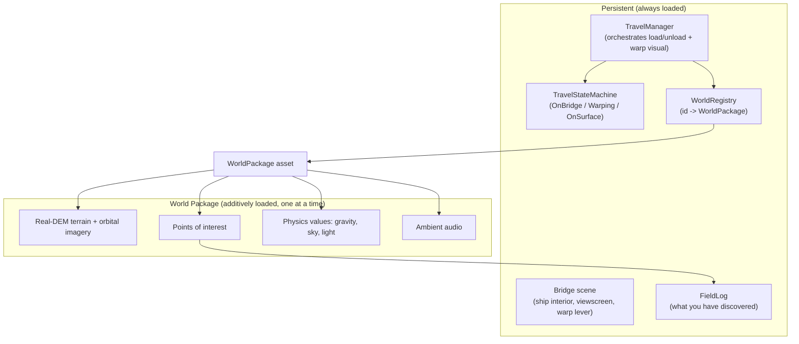
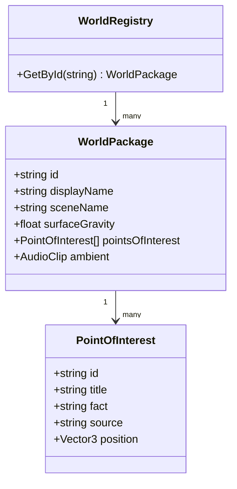
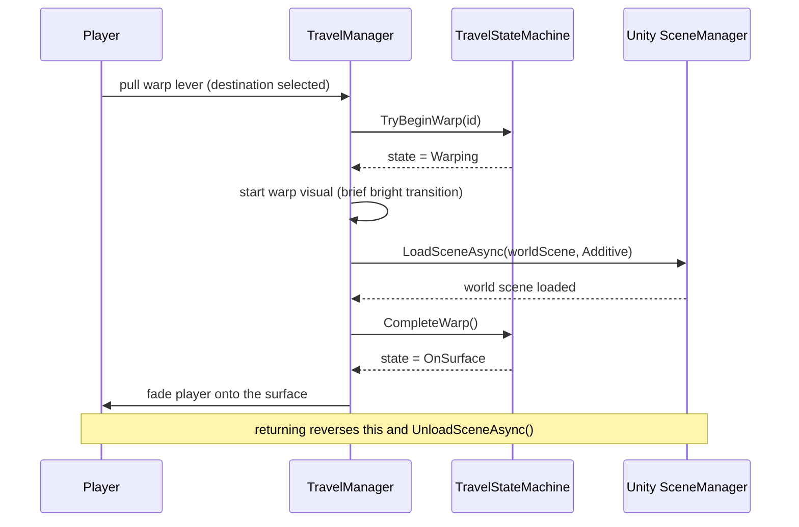
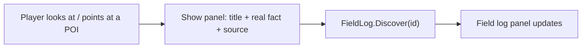

# Wayfinder architecture

This document describes how Wayfinder is put together at runtime and why. It assumes you have read [DESIGN.md](../DESIGN.md). Diagrams use Mermaid, which GitHub renders inline.

## 1. The constraint that drives the whole design

The Samsung Galaxy XR is a standalone mobile headset. It **renders** worlds; it cannot build them live. Any neural reconstruction (SLAM3R and its family) needs a desktop or datacenter GPU and runs as an **offline authoring** step, never on the headset. Therefore:

- Worlds are **authored offline** and **baked into the app** as finished assets.
- The headset only draws **bounded "landing sites,"** one at a time, within a tight frame budget (72 fps minimum, 90 target).
- A continuous, whole-planet, walk-anywhere world is out of scope; that is a custom-engine problem and is not what this game is.

Every decision below follows from this.

## 2. Runtime shape: a persistent hub plus swappable worlds

There is exactly one scene that never unloads: the **Bridge**. Everything else, each world, is loaded on top of it and unloaded when you leave.

Why a persistent hub: it gives the player a stable "home," it is where the future AI companion lives, and it is the surface the warp transition returns you to while a world is torn down.

## 3. The World Package: worlds as data, not code

A **World Package** is a Unity `ScriptableObject` plus a paired scene. It is pure data describing one place:

- `id` and `displayName` (identity, and the label on the viewscreen)
- `sceneName` (the additive scene holding this world's terrain, sky, and light)
- `surfaceGravity` in metres per second squared (Mars 3.72, Moon 1.62 — real constants)
- the list of `PointOfInterest` records (see section 6)
- ambient audio reference

Why data-driven: adding the tenth world costs the same as adding the second (author a package, register it). Nothing about travel, locomotion, discovery, or the field log is per-world code. And the v1.1 AI companion consumes the exact same package data, so no v1 authoring is thrown away.

## 4. Travel and the warp-as-loading-screen

The warp jump is not only flavour. Swapping baked worlds takes real seconds on mobile hardware, so the warp visual **is** the load, dressed as the best moment in the game (the same trick Elite Dangerous and No Man's Sky use for hyperspace). The travel logic is a tiny, tested state machine wrapped by a `TravelManager` MonoBehaviour that talks to Unity's scene system.

The state machine enforces legal transitions and blocks a double-warp (pulling the lever mid-jump does nothing). It is plain C# with unit tests, because it is the one piece of real branching logic in v1.

Comfort rule baked into the warp: it is a **brief bright transition, not a long forward-acceleration tunnel.** Forward motion (vection) is the most nausea-inducing thing in VR, so the warp deliberately avoids it.

## 5. Rendering: real terrain, not splats (for this pillar)

Because v1 leads with solar-system places, the render representation is ordinary **Unity terrain built from real digital elevation models**, not Gaussian splats:

- Solar-system bodies are mapped from orbit (laser altimetry and stereo imagery), giving height maps plus draped imagery. That is exactly what Unity terrain consumes, and it is far more predictable on a mobile GPU than splats.
- Gaussian splatting is reserved for a later pillar (scanned real Earth places), because splats need ground-level photos, which exist for Earth but not for the Martian surface at the fidelity we need.

Consequence: v1 carries **no splat renderer at all**, which removes the single riskiest rendering dependency from the first release.

> **Shape note (July 2026):** the shipped WorldPackage keeps POIs as a JSON
> TextAsset (`unity/Assets/Wayfinder/POI/<site>.json`) rather than the
> `PointOfInterest[]` drawn below, defers the ambient-audio field, and adds a
> `spawnOffset` (Shackleton's clip centres on the permanently shadowed floor,
> so its spawn is rim data). Additive changes; the seam is unchanged.

## 6. Discovery: forward-compatible with the AI companion

Guidance in v1 is pre-authored. Each **Point of Interest** is a structured record: an id, a title, the real fact, a source citation, and a world position. Approaching one (proximity reveal, ~6 m — shipped mechanic; gaze/point reveal remains an option if in-headset feel prefers it) reveals a short panel (optionally spoken by synthesized voice) and calls `FieldLog.Discover(id)`.

The `FieldLog` is a set of discovered ids (add-once, deduplicated, countable) with unit tests. This design is deliberately the v1.1 seam: the **Gemini AI companion reads these same POI records** and turns them into live narration and conversation. Nothing is rebuilt; the companion is a layer on top of data that already exists.

## 7. Locomotion and comfort

All movement obeys Google's Android XR quality rules, which are enforced for store placement:

- **Bridge:** stand and use hands on controls within reach (everything inside ~1.5 m).
- **Surface:** teleport, plus grab-and-pull the world through your play space, plus snap turning and a tunneling comfort vignette. **No smooth continuous camera rotation anywhere.**
- Everything is playable from a **seated or standing 2.0 m space**.

## 8. Performance strategy

The frame budget (about 13.8 ms at 72 Hz) is the master constraint. Levers, applied in order only as needed:

1. Right-size the terrain (heightmap resolution, terrain pixel error, LOD/basemap distance).
2. Cut draw calls; bake static lighting.
3. Eye-tracked **foveated rendering** (full detail only where the eye looks).
4. **Application SpaceWarp** (render at half rate, synthesize in-between frames) only if still short, and only with correct motion vectors.

The build plan gates on this explicitly: Site One must hold 72+ fps on the real headset before any other site is built.

## 9. Module map (the C# you will write in v1)

| Type | Responsibility | Tested? |
|---|---|---|
| `WorldPackage` (ScriptableObject) | Data describing one world | via registry |
| `WorldRegistry` | Look up a package by id | yes (EditMode) |
| `TravelStateMachine` | Legal travel transitions, block double-warp | yes (EditMode) |
| `TravelManager` (MonoBehaviour) | Drive warp visual + additive load/unload | on-device |
| `PointOfInterest` | One discoverable fact record | via field log |
| `FieldLog` | Track distinct discoveries | yes (EditMode) |
| `DestinationMenu` | Viewscreen list bound to the registry | on-device |

## 10. How future work slots in without a rewrite

- **AI companion (v1.1):** a new component that subscribes to POI reveals and the field log, and calls the Gemini Live API. No change to the World Package or discovery data.
- **Exoplanets (v2):** a different terrain-authoring path (real physics parameters drive procedural terrain instead of a real DEM), but the same World Package shape, travel, locomotion, and discovery.
- **Scanned Earth places (v2):** adds a Gaussian-splat renderer and a collision-mesh companion; still delivered as a World Package with the same loop.
- **Procedural planets / multiplayer (later):** additive layers on the same hub-and-package spine.

The through-line: the hub-plus-World-Package structure is the stable core, and every roadmap item is an addition to it rather than a redesign of it.
